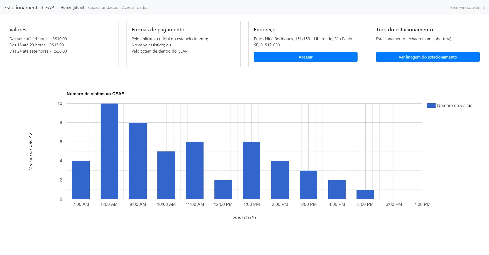
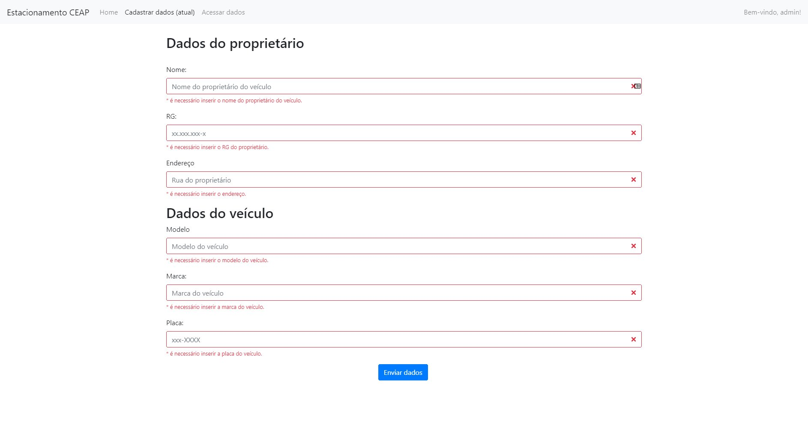
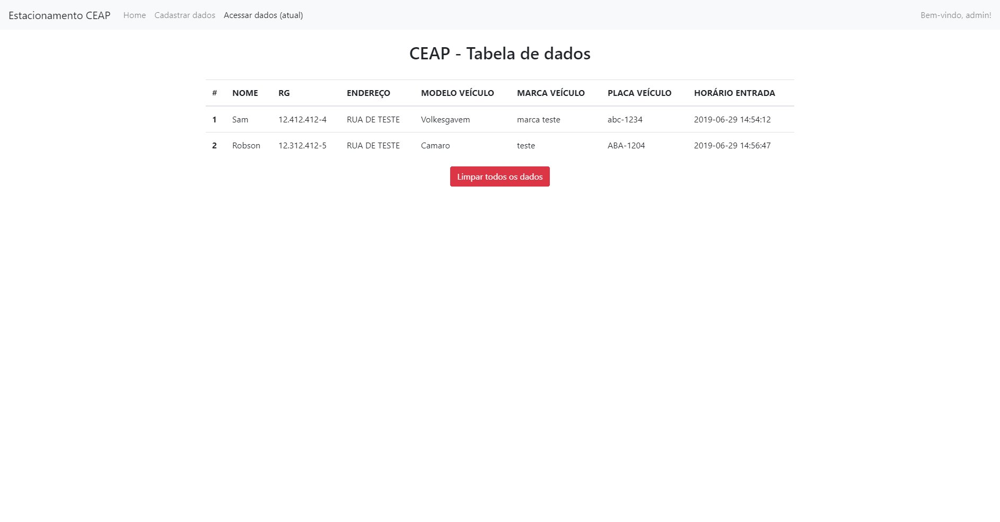

# estacionamento-ceap

O projeto está **desatualizado**, pois foi feito em 2019, como um projeto de estudo, e não houve alterações importantes desde então. Então, não é seguro nem confiável o suficiente para ser usado em ambientes de produção.

-----
Minha versão do projeto proposto pelo professor. Auxiliado, no desenvolvimento do banco de dados. O trabalho era: criar uma página em HTML e PHP capaz de registrar dados básicos de um estacionamento para um banco de dados em SQL.

## Projeto finalizado

Página principal, como administrador.

Página de cadastro de dados. Acessada apenas pelo administrador, caso o usuário não tenha permissão, ele é redirecionado para uma página 404.

Página de acesso de dados. Acessada apenas pelo administrador, caso o usuário não tenha permissão, ele é redirecionado para uma página 404.

## ToDo
- [ ] Consertar os erros ao "deslogar" da conta de administrador;
- [x] Inserir dados (preços, horários, se o estacionamento é aberto ou fechado, endereço etc.) na home page; e
- [x] Adicionar gráficos de visitas na home page.

## Recursos usados
Diversos recursos foram usados, estes serão homenageados aqui:
- w3schools.com
- hostinger.com
- php.net
- stackoverflow.com
- getbootstrap.com
- codewithawa.com
- intechgrity.com
- codeproject.com
- tutorialspoint.com
- youtube.com
- images.pexels.com
- codigofonte.com.br
